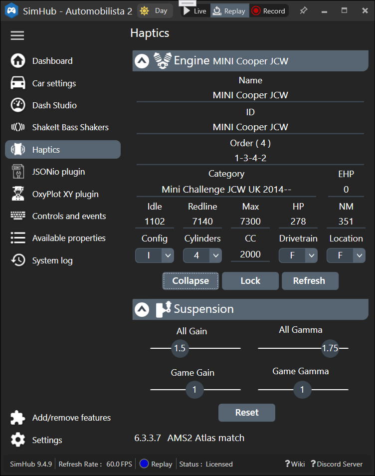
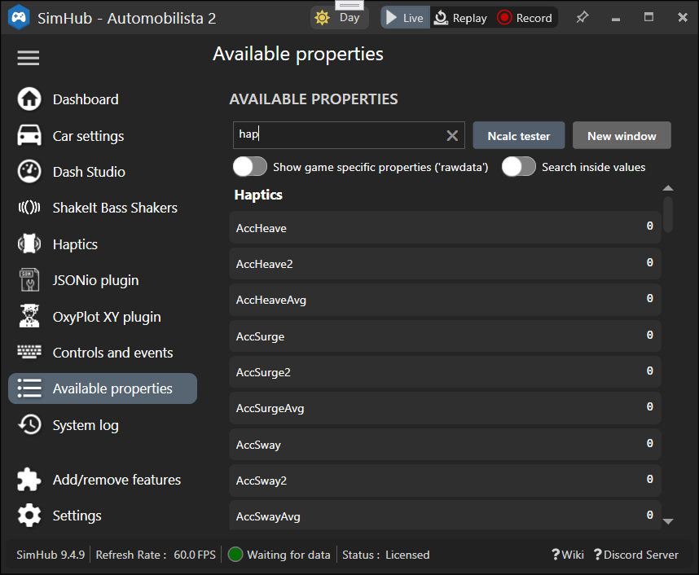

# CarSpecAtlas for SimHub SimHap plugin
 Visual Studio project to build `CarSpecAtlas.dll`
 of per-SimHub-game `CarSpec` lists for
 [**SimHap** plugin](https://github.com/blekenbleu/SimHap);  
   

 [**SimHap** plugin](https://github.com/blekenbleu/SimHap)
 makes available [**SimHub**](https://www.simhubdash.com/)
 Haptics [properties](https://github.com/SHWotever/SimHub/wiki/Javascript-Formula-Engine#accessing-simhub-properties-game-datas)
 from `CarSpec` for current SimHub game and car.  
   

- *5 Oct 2024*  dll size for trivial dictionary:  8 kB
	- [iterate dictionary](https://code-maze.com/csharp-iterate-through-dictionary/)  
    - [iterate list](https://www.tutorialsteacher.com/articles/foreach-loop-in-csharp)  
- *6 Oct*
	- 1054KB DLL using Atlas_engine_data.json content
